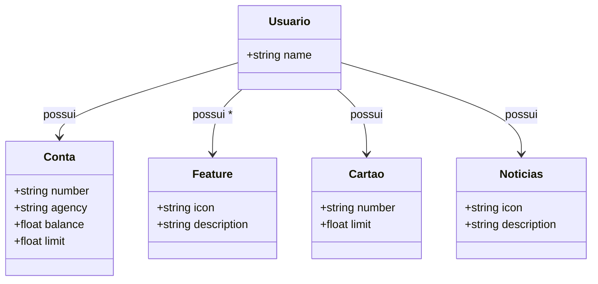

# Avanade Decola Tech 2025 
JAVA RESTful API criada para o Decola Tech 2025

## Diagrama de classes

# Diagrama de Classes - Usuário do Banco

Este diagrama representa a estrutura de classes baseada no JSON de um usuário do banco.

